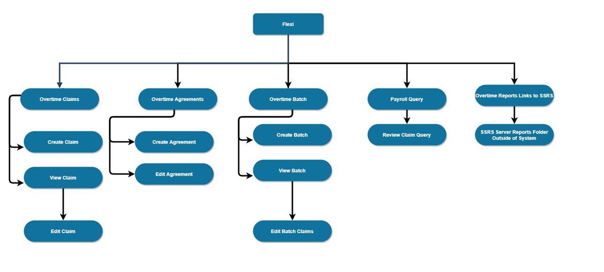
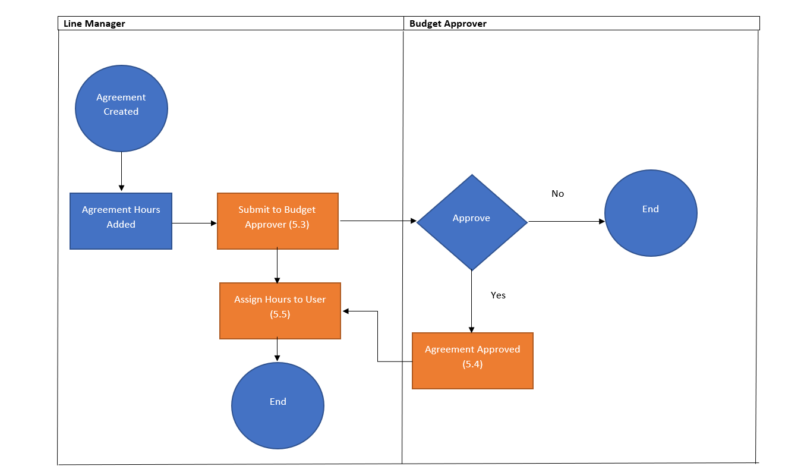

# My Database Portfolio

> Hello everyone that views this portfolio.

My name is Aaron Barkas and I am an I.T graduate with over 2 years experience in the I.T industry. Working as a Service Desk Analyst and a Database Analyst. 

This portfolio is written using the markdown markup (quite a mouthful) language and using the Docsify document site generator that scaffolds a static documentation site.

Docsify is available at:  [Docsify] (https://docsify.js.org/).

As I hope to keep this as a static site with one page so you can navigate the different writing and documentation that I have developed in employment or in my own free time as a learning tool.

This portfolio is also a work in progress and will improve as my skills develop.

# Web Application Documentation Examples

Any information in these examples of my work were created by me and are GDPR and Intellectual Property compliant and contain no identifiable data or application source code. Examples here are of generic Create Read Update Delete database web application examples. 

## Overtime Web Application

The overtime web application was created to allow staff to submit overtime claims. I was tasked to create the documentation from a managers perspective so that they could understand the system without the technical knowledge to do so.

### Site Map

The site map was created by me to show the different web pages on the web application and how a user would navigate from each page.

### Overtime Process Flow

The process flow was to show the user journey and the interaction between different users and their departments for the web application. Note. Orange objects referred to email examples in later sections of the documentation for GDPR and Intellectual Property issues I will not be able to display those email examples later in this portfolio.

 

### Process flow - Manager View

The manager view shows the user journey for the manager of the web application.

# Database Design

In this section I will display the database designs I have used professionally or as a hobby.

## Price Comparison Customer Data Example

This design wasn't used professionally but is based of the potential data a price comparison site will collect to compare customer data to match with the best quote from insurance providers. 

## Carpark System

In my previous employment I assisted with the created of a new carpark database to be used as a web application. This isn't the same design but has been changed as to not infringe any Intellectual property.

### ERD Carpark System Diagram

ERD diagram displays the relationships between each table within the database.

### Use Case Carpark System Diagram

A use case diagram details the different tasks that a user will be able to perform on the system.

